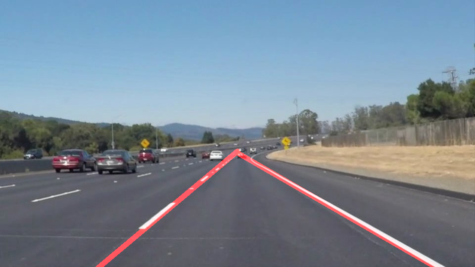

**Finding Lane Lines on the Road** 
---

**Finding Lane Lines on the Road**

The goals / steps of this project are the following:
* Make a pipeline that finds lane lines on the road
* Reflect findings in a written report

[//]: # (Image References)
[solidWhiteCurve]: ./result_images/solidWhiteCurve.png
[solidWhiteRight]: ./result_images/solidWhiteRight.png
[solidYellowCurve]: ./result_images/solidYellowCurve.png
[solidYellowCurve2]: ./result_images/solidYellowCurve2.png
[whiteCarLaneSwitch]: ./result_images/whiteCarLaneSwitch.png

---

### Reflection

### 1. Describe your pipeline. As part of the description, explain how you modified the draw_lines() function.

My pipeline was divided into 2 main parts: image preprocessing, then line detection.

In preprocessing stage I grayscaled the image, then I applied Gaussian smoothing. 
This step was done to reduce the size of the image and to reduce noise in the image before working on it further. 
After that, I fed the image through the Canny function to get the array of points which are the coordinates of the edges.
Then, assuming stationary camera, I limited the area further by applying region masking on the Canny edges array, limiting it to the bottom half of the image. 
The masked area was further split into left-right sides. This was done to make it easier to determine left-right lane fittings.

I added some more processing methods in the line detection stage. 
Instead of drawing the lines using coordinates from Hough transform directly, I used the points to obtain the line of best fit, then modified the draw_lines() function to use these new, extrapolated points to draw a single line extending from origin to the middle of the image.

### 2. Sample results

I chose a static image to test my code on as a starting point.
Since a video is just a series of images, the process would remain the same throughout the iterations.
The challenge then would be to figure out a just-right Hough transformation setting that can be applied to a wide range of scenario.

The rest of the test_images can be found in here:
[solidWhiteRight]
[solidYellowCurve]
[solidYellowCurve2]
[whiteCarLaneSwitch]

### 3. Potential shortcomings and possible improvements to pipeline

My current pipeline did well with the test images and videos, but failed the challenge video. Regarding the shortcomings, there are several possibilities:
- different lighting condition: not applicable in this case since they are roughly the same, but I imagine it would perform poorly in cloudy/nighttime since there is no intensity correction.
- different shape of the lane line: this might be the main reason why the pipeline failed. Since the lane lines were not straight, the Hough transform might have returned back widely varying coordinates, and as the result the line fitting was way off.
    This might be fixable with some transformations on the source image using angle data from accelerometer.
- there might be better ways to achieve what I wanted with my pipeline with faster / simpler method.